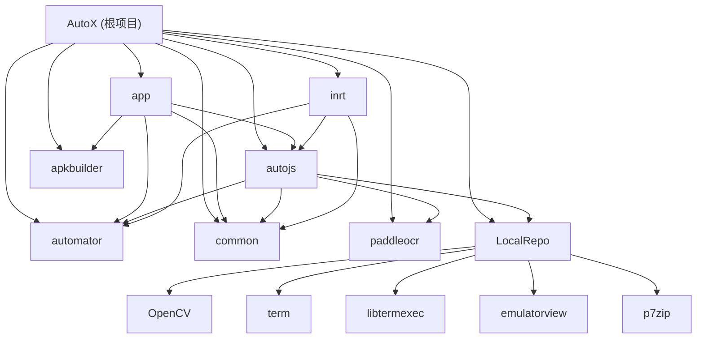

# CLAUDE.md - AutoX 项目根目录

## 变更记录 (Changelog)

| 日期 | 变更内容 |
|------|---------|
| 2026-06-03 | 初始生成：全仓扫描，创建根级和模块级 CLAUDE.md |
| 2026-06-03 | 深度补扫：autojs Runtime API (18类)、JS 模块层 (40模块)、automator 无障碍服务 (49文件)、app UI 层 (90+文件) |

---

## 项目愿景

AutoX.js（Autox.js）是基于 [hyb1996/Auto.js](https://github.com/hyb1996/Auto.js) 的开源 Android 自动化脚本平台。它提供 JavaScript 运行时环境，支持无障碍服务自动化、OCR 文字识别、截屏找图、定时任务、脚本打包成 APK 等核心能力，目标是成为移动端的自动化工作流工具。

- **开源仓库**：https://github.com/kkevsekk1/AutoX
- **文档站点**：http://doc.autoxjs.com/
- **论坛社区**：http://www.autoxjs.com/
- **当前版本**：6.3.6（appVersionCode: 636）

---

## 架构总览

项目采用 **Android Gradle 多模块架构**，使用 Kotlin DSL (`build.gradle.kts`) 构建配置，Kotlin 1.6.20，Jetpack Compose UI，Rhino JS 引擎。

### 核心技术栈

| 层面 | 技术 |
|------|------|
| 语言 | Kotlin / Java 混合 |
| 构建 | Gradle 7.2.1 + Kotlin DSL |
| UI | Jetpack Compose + 传统 View 混合 |
| JS 引擎 | Rhino 1.7.14（ES6 支持） |
| OCR 引擎 | PaddleOCR（百度 Paddle Lite）+ Google ML Kit |
| 计算机视觉 | OpenCV 4.5.5 |
| 网络 | OkHttp + Retrofit + Ktor WebSocket |
| 异步 | RxJava 2 + Kotlin Coroutines |
| 数据库 | SQLite（直接操作） |
| 测试 | JUnit 4（仅单元测试） |

---

## 模块结构图



---

## 模块索引

| 模块路径 | 类型 | 一句话职责 |
|----------|------|-----------|
| `app/` | Application | 主应用程序入口，包含 UI 界面、脚本管理、APK 签名、DevPlugin 远程连接 |
| `autojs/` | Library | JavaScript 脚本引擎核心，Rhino 运行时、脚本 API、OCR、图像处理 |
| `automator/` | Library | UI 自动化层，无障碍服务封装、控件选择器、手势操作 |
| `common/` | Library | 通用工具库，文件 IO、权限管理、并发工具、加解密 |
| `inrt/` | Application | 打包后的脚本运行时（template APK），独立运行用户脚本 |
| `apkbuilder/` | Library | APK 构建器，资源编辑（ARSC/AXML）、Manifest 修改、APK 打包 |
| `paddleocr/` | Library | PaddleOCR 文字识别封装，基于 Paddle Lite 推理引擎 |
| `LocalRepo/` | 本地仓库 | OpenCV 4.5.5、终端模拟器（term）、7zip 压缩等预编译库 |

---

## 运行与开发

### 环境要求

- JDK 15
- Android Studio Bumblebee (2021.1.1)
- Android SDK: compileSdk 32, minSdk 21, targetSdk 26
- Gradle 7.2.1

### 编译命令

**调试版安装到设备：**

```shell
./gradlew inrt:assembleTemplateDebug && ./gradlew inrt:cp2APPDebug && ./gradlew app:assembleV6Debug && ./gradlew app:installV6Debug
```

**发布版编译：**

```shell
./gradlew inrt:assembleTemplate && ./gradlew inrt:cp2APP && ./gradlew app:assembleV6
```

**Android Studio 调试前准备：**

```shell
./gradlew inrt:assembleTemplate && ./gradlew inrt:cp2APP
```

> 注意：inrt 的 template APK 必须先编译并拷贝到 app/assets，再编译 app 主程序。这是打包功能的依赖链。

### 版本管理

版本信息统一管理在 `project-versions.json` 中，包括 appVersionCode、appVersionName、SDK 版本等。

### 产品变体 (Product Flavors)

| 变体 | 说明 |
|------|------|
| `common` | 通用渠道版 |
| `v6` | 开发版（applicationId 后缀 `.v6`） |
| `inrt:common` | 运行时通用版 |
| `inrt:template` | 运行时模板版（用于打包） |

---

## 测试策略

项目仅有极少量单元测试，主要为占位性质：

| 模块 | 测试文件 | 状态 |
|------|---------|------|
| app | `ExampleUnitTest.java`, `Test.kt` | 占位 |
| autojs | `ExampleUnitTest.java`, `MultiLinePreprocessorTest.java`, `XmlConverterTest.java`, `Test.kt` | 有少量实际测试 |
| inrt | `ExampleUnitTest.java` | 占位 |
| common | `ExampleUnitTest.java` | 占位 |
| paddleocr | `ExampleUnitTest.kt` | 占位 |

> 测试覆盖率极低，无集成测试和端到端测试。

---

## 编码规范

- Kotlin 与 Java 混合编写，新功能倾向使用 Kotlin
- 包名结构：`org.autojs.autojs.*`（app 模块）、`com.stardust.autojs.*`（核心库）
- UI 采用 Jetpack Compose 和传统 View 混合方式
- 使用 ButterKnife 和 Android Annotations 进行视图绑定（老代码）
- 资源国际化：`res-i18n` 目录存放多语言资源

---

## AI 使用指引

### 关键入口文件

- **App 启动**：`app/src/main/java/org/autojs/autojs/App.kt`
- **主界面**：`app/src/main/java/org/autojs/autojs/ui/main/MainActivity.kt`
- **脚本引擎**：`autojs/src/main/java/com/stardust/autojs/engine/RhinoJavaScriptEngine.kt`
- **脚本运行时**：`autojs/src/main/java/com/stardust/autojs/runtime/ScriptRuntime.java`
- **JS 初始化**：`autojs/src/main/assets/init.js`

### OCR 相关入口

- **Paddle OCR API**：`autojs/src/main/java/com/stardust/autojs/runtime/api/Paddle.kt`
- **Google ML Kit API**：`autojs/src/main/java/com/stardust/autojs/runtime/api/GoogleMLKit.kt`
- **PaddleOCR 预测器**：`paddleocr/src/main/java/com/baidu/paddle/lite/demo/ocr/Predictor.kt`

### 开发注意事项

1. **inrt 构建顺序**：修改 inrt 模块后，必须先执行 `inrt:assembleTemplate` + `inrt:cp2APP` 将 template.apk 复制到 app/assets，再编译 app
2. **签名配置**：签名路径为项目内 `keystores/sign.properties`（相对路径），默认 JKS 位于 `H:/ocr/AutoX_new/apkbuilder/src/main/assets/autox-default.jks`
3. **Rhino 引擎限制**：使用 ES6 但 optimizationLevel=-1（解释模式），性能受限
4. **构建产物路径**：APK 输出在 `app/build/outputs/apk/v6/debug` 或 `release` 下

---

## 模块依赖关系

```
app
 ├── automator
 ├── common
 ├── autojs
 │    ├── automator
 │    ├── common
 │    ├── paddleocr
 │    ├── LocalRepo/OpenCV
 │    ├── LocalRepo/term
 │    ├── LocalRepo/libtermexec
 │    ├── LocalRepo/emulatorview
 │    └── LocalRepo/p7zip
 └── apkbuilder

inrt
 ├── automator
 ├── common
 └── autojs
```
